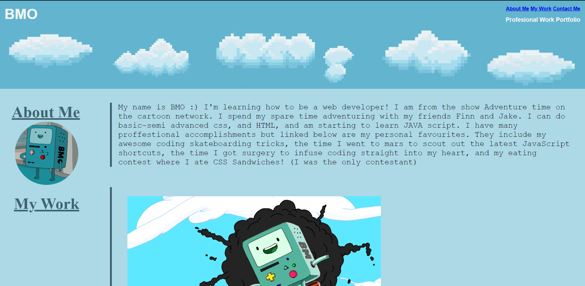

README.md
https://wrn007.github.io/Adv_CSS_Chal/
please open in "preview" if possible to display images

This challenge testing everything we know from start to finish. This includes HTML elements, as well as both basic and advanced CSS. This knowledge was used to create a professional portfolio for someone to show to their employer. I thought it would be a little weird to do a real person, so I opted for a cartoon character as this does not take away from the skill displayed in the creation of the website. All of the links in the document lead to www.google.com as I do not have any created applications as it asks for in the criteria, however this can easily be changed by simply changing the links in the HTML. 

This image displays what the top of the website should look like when open fully

This image displays what the bottom of the website should look like when the window is not fully open

